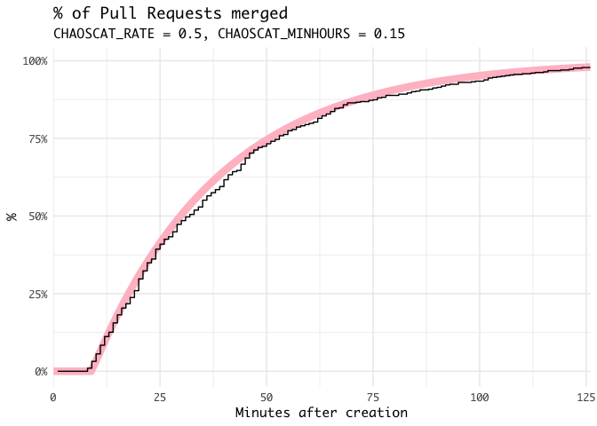

# ChaosCat

Chaos engineering for Pull Requests. ChaosCat merges open pull requests
at random subject to configurable parameters.

Clone and run with stack:

``` bash
git clone
cd chaoscat

# Set environment variables
export CHAOSCAT_OWNER=torvaney
export CHAOSCAT_REPO=example-pr-repo
export CHAOSCAT_AUTH=abcdefghijklmnop  # Put your actual GitHub auth token here
export CHAOSCAT_RATE=0.5       # Avg hours (after minimum) before closing a pull request
export CHAOSCAT_MINHOURS=0.15  # Minimum hours before a pull request is closed

stack run
```

## How does it work?

ChaosCat will merge Pull Requests according to an [exponential
distribution](https://en.wikipedia.org/wiki/Exponential_distribution).
This means that Pull Requests will be merged independently of one
another, and at a constant average rate.

This average rate is configured with the `CHAOSCAT_RATE` environment
variable, which sets the average (mean) time before a Pull Request is
closed.

You can also set a minimum amount of time before a Pull Request gets
merged, with the `CHAOSCAT_MINHOURS` environment variable.

We can see what this distribution looks like in practice when applied to
the torvaney/example-pr-repo repo with a minimum time of 0.15 and a rate
of 0.5 (30):

<!-- -->

As you can see, no Pull Requests are merged initially. But once the
minimum time threshold is passed, they are merged at random, following
the exponential curve as expected (pink line).

## But… why?

ChaosCat is a response to the question: what if we applied the
principles of [Chaos
Engineering](https://en.wikipedia.org/wiki/Chaos_engineering) to our
development practices themselves?

[principlesofchaos.org](http://principlesofchaos.org) states that

> Chaos Engineering is the discipline of experimenting on a system in
> order to build confidence in the system’s capability to withstand
> turbulent conditions in production.

In the same way, if you want to ensure that you can ship features to
production frequently, and gracefully handle bugs, what better way than
to ship features… automatically?

Chaoscat (named after GitHub’s Octocat and Netflix’s Chaos Monkey)
merges your pull requests at random, forcing you to develop robust
processes around code review and feature releases
